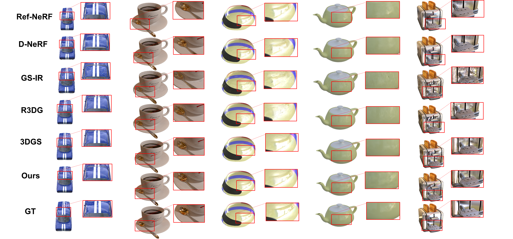

# Reflections Unlock: Geometry-Aware Reflection Disentanglement in 3D Gaussian Splatting for Photorealistic Scenes Rendering
Jiayi Song1†, Zihan Ye1†, Qingyuan Zhou1†, Weidong Yang1, Ben Fei2*, Jingyi Xu1, Ying He3, Wanli Ouyang2 († indicates equal contribution, * is the corresponding author)

This repository contains the official authors implementation associated with the paper "Reflections Unlock: Geometry-Aware Reflection Disentanglement in 3D Gaussian Splatting for Photorealistic Scenes Rendering".


Abstract: *Accurately rendering scenes with reflective surfaces remains a significant challenge in novel view synthesis, as existing methods like Neural Radiance Fields (NeRF) and 3D Gaussian Splatting (3DGS) often misinterpret reflections as physical geometry, resulting in degraded reconstructions. Previous methods rely on incomplete and non-generalizable geometric constraints, leading to misalignment between the positions of Gaussian splats and the actual scene geometry. When dealing with real-world scenes containing complex geometry, the accumulation of Gaussians further exacerbates surface artifacts and results in blurred reconstructions. To address these limitations, in this work, we propose Ref-Unlock, a novel geometry-aware reflection modeling framework based on 3D Gaussian Splatting, which explicitly disentangles transmitted and reflected components to better capture complex reflections and enhance geometric consistency in real-world scenes. Our approach employs a dual-branch representation with high-order spherical harmonics to capture high-frequency reflective details, alongside a reflection removal module providing pseudo reflection-free supervision to guide clean decomposition. Additionally, we incorporate pseudo-depth maps and a geometry-aware bilateral smoothness constraint to enhance 3D geometric consistency and stability in decomposition. Extensive experiments demonstrate that Ref-Unlock significantly outperforms classical GS-based reflection methods and achieves competitive results with NeRF-based models, while enabling flexible vision foundation models (VFMs) driven reflection editing. Our method thus offers an efficient and generalizable solution for realistic rendering of reflective scenes.*

### Setup

The environment setup can follow that of [3DGS](https://github.com/graphdeco-inria/gaussian-splatting).  
For submodules such as **Depth Anything V2** and the **Reflection Removal Model (RRM)**, please refer to their respective environment configurations as provided in their original repositories.


### Running

To run the optimizer, simply use

```shell
python train.py -s <path to COLMAP or NeRF Synthetic dataset> -d <path to depth maps> -m <path for saving results> --eval
```

<details>
<summary><span style="font-weight: bold;">Command Line Arguments for train.py</span></summary>

  #### --source_path / -s
  Path to the source directory containing a COLMAP or Synthetic NeRF data set.
  #### --model_path / -m 
  Path where the trained model should be stored (```output/<random>``` by default).
  #### --images / -i
  Alternative subdirectory for COLMAP images (```images``` by default).
  #### --eval
  Add this flag to use a MipNeRF360-style training/test split for evaluation.
  #### --resolution / -r
  Specifies resolution of the loaded images before training. If provided ```1, 2, 4``` or ```8```, uses original, 1/2, 1/4 or 1/8 resolution, respectively. For all other values, rescales the width to the given number while maintaining image aspect. **If not set and input image width exceeds 1.6K pixels, inputs are automatically rescaled to this target.**
  #### --data_device
  Specifies where to put the source image data, ```cuda``` by default, recommended to use ```cpu``` if training on large/high-resolution dataset, will reduce VRAM consumption, but slightly slow down training. Thanks to [HrsPythonix](https://github.com/HrsPythonix).
  #### --white_background / -w
  Add this flag to use white background instead of black (default), e.g., for evaluation of NeRF Synthetic dataset.
  #### --sh_degree
  Order of spherical harmonics to be used (no larger than 3). ```3``` by default.
  #### --convert_SHs_python
  Flag to make pipeline compute forward and backward of SHs with PyTorch instead of ours.
  #### --convert_cov3D_python
  Flag to make pipeline compute forward and backward of the 3D covariance with PyTorch instead of ours.
  #### --debug
  Enables debug mode if you experience erros. If the rasterizer fails, a ```dump``` file is created that you may forward to us in an issue so we can take a look.
  #### --debug_from
  Debugging is **slow**. You may specify an iteration (starting from 0) after which the above debugging becomes active.
  #### --iterations
  Number of total iterations to train for, ```30_000``` by default.
  #### --ip
  IP to start GUI server on, ```127.0.0.1``` by default.
  #### --port 
  Port to use for GUI server, ```6009``` by default.
  #### --test_iterations
  Space-separated iterations at which the training script computes L1 and PSNR over test set, ```7000 30000``` by default.
  #### --save_iterations
  Space-separated iterations at which the training script saves the Gaussian model, ```7000 30000 <iterations>``` by default.
  #### --checkpoint_iterations
  Space-separated iterations at which to store a checkpoint for continuing later, saved in the model directory.
  #### --start_checkpoint
  Path to a saved checkpoint to continue training from.
  #### --quiet 
  Flag to omit any text written to standard out pipe. 
  #### --feature_lr
  Spherical harmonics features learning rate, ```0.0025``` by default.
  #### --opacity_lr
  Opacity learning rate, ```0.05``` by default.
  #### --scaling_lr
  Scaling learning rate, ```0.005``` by default.
  #### --rotation_lr
  Rotation learning rate, ```0.001``` by default.
  #### --position_lr_max_steps
  Number of steps (from 0) where position learning rate goes from ```initial``` to ```final```. ```30_000``` by default.
  #### --position_lr_init
  Initial 3D position learning rate, ```0.00016``` by default.
  #### --position_lr_final
  Final 3D position learning rate, ```0.0000016``` by default.
  #### --position_lr_delay_mult
  Position learning rate multiplier (cf. Plenoxels), ```0.01``` by default. 
  #### --densify_from_iter
  Iteration where densification starts, ```500``` by default. 
  #### --densify_until_iter
  Iteration where densification stops, ```15_000``` by default.
  #### --densify_grad_threshold
  Limit that decides if points should be densified based on 2D position gradient, ```0.0002``` by default.
  #### --densification_interval
  How frequently to densify, ```100``` (every 100 iterations) by default.
  #### --opacity_reset_interval
  How frequently to reset opacity, ```3_000``` by default. 
  #### --lambda_dssim
  Influence of SSIM on total loss from 0 to 1, ```0.2``` by default. 
  #### --percent_dense
  Percentage of scene extent (0--1) a point must exceed to be forcibly densified, ```0.01``` by default.

</details>
<br>


### Evaluation

You can simply evaluate the model performance, using:
```shell
python render.py -m <path to pre-trained model> -s <path to COLMAP dataset> --eval --render_images --skip_train  -d <path to depth maps>
python metrics.py -m <path to pre-trained model>
```

<details>
<summary><span style="font-weight: bold;">Command Line Arguments for render.py</span></summary>

  #### --model_path / -m 
  Path to the trained model directory you want to create renderings for.
  #### --skip_train
  Flag to skip rendering the training set.
  #### --skip_test
  Flag to skip rendering the test set.
  #### --quiet 
  Flag to omit any text written to standard out pipe. 

  **The below parameters will be read automatically from the model path, based on what was used for training. However, you may override them by providing them explicitly on the command line.** 

  #### --source_path / -s
  Path to the source directory containing a COLMAP or Synthetic NeRF data set.
  #### --images / -i
  Alternative subdirectory for COLMAP images (```images``` by default).
  #### --eval
  Add this flag to use a MipNeRF360-style training/test split for evaluation.
  #### --resolution / -r
  Changes the resolution of the loaded images before training. If provided ```1, 2, 4``` or ```8```, uses original, 1/2, 1/4 or 1/8 resolution, respectively. For all other values, rescales the width to the given number while maintaining image aspect. ```1``` by default.
  #### --white_background / -w
  Add this flag to use white background instead of black (default), e.g., for evaluation of NeRF Synthetic dataset.
  #### --convert_SHs_python
  Flag to make pipeline render with computed SHs from PyTorch instead of ours.
  #### --convert_cov3D_python
  Flag to make pipeline render with computed 3D covariance from PyTorch instead of ours.

</details>

<details>
<summary><span style="font-weight: bold;">Command Line Arguments for metrics.py</span></summary>

  #### --model_paths / -m 
  Space-separated list of model paths for which metrics should be computed.
</details>
<br>

### Processing your own Scenes

Our COLMAP loaders expect the following dataset structure in the source path location:

```
<location>
|---images
|   |---<image 0>
|   |---<image 1>
|   |---...
|---sparse
    |---0
        |---cameras.bin
        |---images.bin
        |---points3D.bin
```

For rasterization, the camera models must be either a SIMPLE_PINHOLE or PINHOLE camera. We provide a converter script ```convert.py```, to extract undistorted images and SfM information from input images. Optionally, you can use ImageMagick to resize the undistorted images. This rescaling is similar to MipNeRF360, i.e., it creates images with 1/2, 1/4 and 1/8 the original resolution in corresponding folders. To use them, please first install a recent version of COLMAP (ideally CUDA-powered) and ImageMagick. Put the images you want to use in a directory ```<location>/input```.
```
<location>
|---input
    |---<image 0>
    |---<image 1>
    |---...
```
 If you have COLMAP and ImageMagick on your system path, you can simply run 
```shell
python convert.py -s <location> [--resize] #If not resizing, ImageMagick is not needed
```
Alternatively, you can use the optional parameters ```--colmap_executable``` and ```--magick_executable``` to point to the respective paths. Please note that on Windows, the executable should point to the COLMAP ```.bat``` file that takes care of setting the execution environment. Once done, ```<location>``` will contain the expected COLMAP data set structure with undistorted, resized input images, in addition to your original images and some temporary (distorted) data in the directory ```distorted```.

If you have your own COLMAP dataset without undistortion (e.g., using ```OPENCV``` camera), you can try to just run the last part of the script: Put the images in ```input``` and the COLMAP info in a subdirectory ```distorted```:
```
<location>
|---input
|   |---<image 0>
|   |---<image 1>
|   |---...
|---distorted
    |---database.db
    |---sparse
        |---0
            |---...
```
Then run 
```shell
python convert.py -s <location> --skip_matching [--resize] #If not resizing, ImageMagick is not needed
```

<details>
<summary><span style="font-weight: bold;">Command Line Arguments for convert.py</span></summary>

  #### --no_gpu
  Flag to avoid using GPU in COLMAP.
  #### --skip_matching
  Flag to indicate that COLMAP info is available for images.
  #### --source_path / -s
  Location of the inputs.
  #### --camera 
  Which camera model to use for the early matching steps, ```OPENCV``` by default.
  #### --resize
  Flag for creating resized versions of input images.
  #### --colmap_executable
  Path to the COLMAP executable (```.bat``` on Windows).
  #### --magick_executable
  Path to the ImageMagick executable.
</details>
<br>


### Depth regularization

To have better reconstructed scenes we use depth maps as priors during optimization with each input images.

When training on a synthetic dataset, depth maps can be produced and they do not require further processing to be used in our method.

For real world datasets depth maps should be generated for each input images, to generate them please do the following:
1. Clone [Depth Anything v2](https://github.com/DepthAnything/Depth-Anything-V2?tab=readme-ov-file#usage):
    ```
    git clone https://github.com/DepthAnything/Depth-Anything-V2.git
    ```
2. Download weights from [Depth-Anything-V2-Large](https://huggingface.co/depth-anything/Depth-Anything-V2-Large/resolve/main/depth_anything_v2_vitl.pth?download=true) and place it under `Depth-Anything-V2/checkpoints/`
3. Generate depth maps:
   ```
   python Depth-Anything-V2/run.py --encoder vitl --pred-only --grayscale --img-path <path to input images> --outdir <output path>
   ```

A new parameter should be set when training  `-d <path to depth maps>`.

### Generate Clean Images from RRM

To generate them please do the following:
1. Clone [DSRNet](https://github.com/mingcv/DSRNet):
    ```
    git clone https://github.com/mingcv/DSRNet.git
    ```
2. Download weights from [dsrnet_l_4000_epoch33](https://drive.google.com/file/d/1hFZItZAzAt-LnfNj-2phBRwqplDUasQy/view?usp=sharing) and place it under `weights` dir.
3. Generate clean images:
   ```
   python test_sirs.py --inet dsrnet_l_nature --model dsrnet_model_sirs --dataset sirs_dataset  --name dsrnet_l_4000_test --hyper --if_align --resume --weight_path "./weights/dsrnet_l_4000_epoch33.pt" --base_dir "[YOUR_DATA_DIR]"
   ```
### Visual Results on RFFR and ShinyBlender



